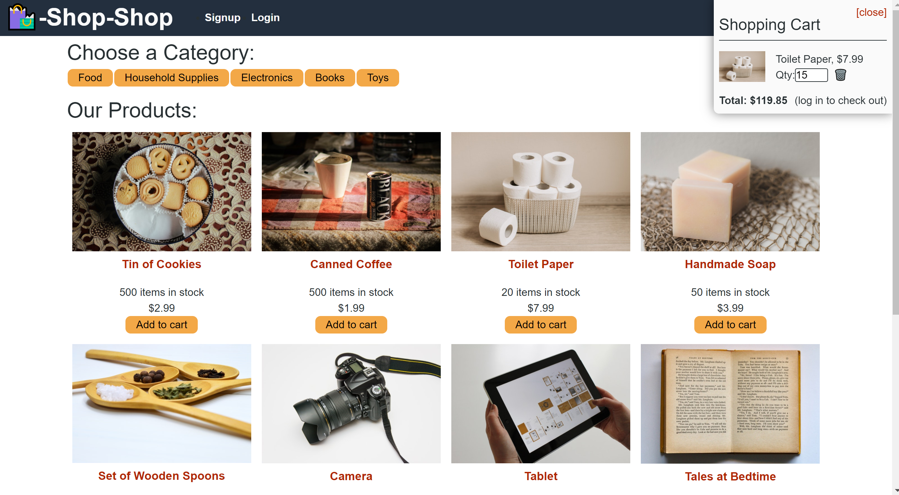

  # MERN ecomerce 
  
   
    
    
  Its is an "Amazon-like" eComerce app, utilizing a global state. Initialy this was done through the React Context API, how ever it has now been converted to use Redux.
  
  ## Table of Contents
  
  
  * [License](#license)
  * [Contributing](#Contributing)
  * [Tests](#Tests)
  * [Questions](#Questions)
  
   [Link to deployed application](https://boiling-tundra-93316.herokuapp.com/)

 </img> 
  
  
  ## License
  MIT
  ## Contributing
  If one would like to contribute, please open a new issue or contact the email provided below.
  ## Tests
  to test in a dev enviroment, install the Jest dependancies and run "npm run test"
  ## Questions
  [Email](mailto:emailcodydiab@gmail.com)

  [GitHub](https://github.com/CodyDiab)
